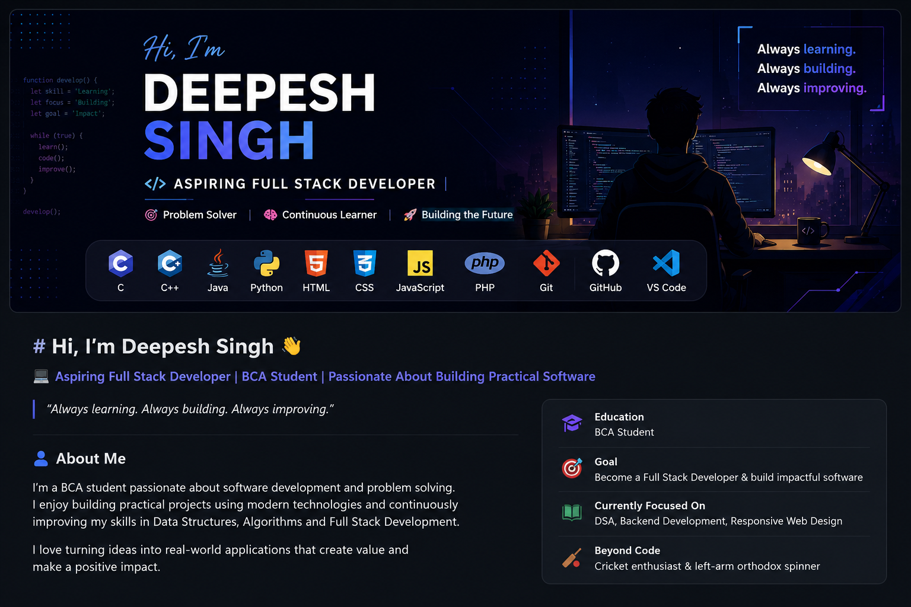

# Hi, I'm Deepesh Singh 👋

  

### 💻 Aspiring Full Stack Developer | BCA Student | Passionate About Building Practical Software

> *"Always learning. Always building. Always improving."*

## 👨‍💻 About Me

I'm a **BCA student** passionate about software development and problem-solving. I enjoy building practical projects that strengthen my programming skills and deepen my understanding of modern technologies.

- 🔭 Currently building projects using **Python, HTML, CSS, JavaScript, and PHP**
- 🌱 Learning **Data Structures & Algorithms, Backend Development, and Responsive Web Design**
- 💡 Interested in **Full Stack Development, Data Science, and Cybersecurity**
- 🎯 Goal: Become a skilled **Full Stack Developer** and contribute to impactful software projects
- 🏏 Outside of coding, I'm a **cricket enthusiast** and a **left-arm orthodox spinner**

## 🛠️ Tech Stack

### 👨‍💻 Languages

### 🌐 Web Development

### 🛠️ Tools & Technologies

## 📊 GitHub Statistics

  
  

  

## 🚀 Featured Projects

| Project | Description | Tech Stack |
|---------|-------------|------------|
| **📄 Resume Website** | A responsive personal resume website showcasing my skills, education, and projects using semantic HTML and CSS. | HTML, CSS |
| **🎮 Rock Paper Scissors** | A command-line Python implementation of the classic Rock Paper Scissors game with user interaction and game logic. | Python |
| **▶️ Distraction-Free YouTube** | A clean web interface designed to provide a distraction-free YouTube viewing experience. | HTML, CSS, JavaScript |
| **👤 Profile Card** | A modern and responsive profile card UI demonstrating HTML and CSS design fundamentals. | HTML, CSS |

### 🔗 Repositories

- 📄 **Resume Website** → https://github.com/its-deepesh/Resume
- 👤 **Profile Card** → https://github.com/its-deepesh/profile-card
- 🎮 **Rock Paper Scissors** → https://github.com/its-deepesh/RockPaperScissor-using-Python
- ▶️ **Distraction-Free YouTube** → https://github.com/its-deepesh/Distraction-free-youtube

## 📚 Currently Learning

- 🌱 Data Structures & Algorithms
- ⚙️ Backend Development
- 🌐 Full Stack Web Development
- 📱 Responsive Web Design
- 🔐 Cybersecurity Fundamentals
- 📊 Data Science Basics

## 🎯 2026 Goals

- 🚀 Build 20+ quality software projects
- 💼 Secure a Software Development Internship
- 🌍 Contribute to Open Source Projects
- 📖 Strengthen DSA & Problem-Solving Skills
- ⚡ Become a Full Stack Developer

## 📫 Connect With Me

- 💼 **LinkedIn:** www.linkedin.com/in/deepesh-singh-8aa82134a
- 🐙 **GitHub:** https://github.com/its-deepesh

## 👀 Profile Views

  

## 📈 Contribution Graph

  

## 💡 Fun Fact

> "I believe consistent learning and building real-world projects is the fastest way to grow as a developer."

---

  ⭐ If you like my work, consider starring my repositories!

